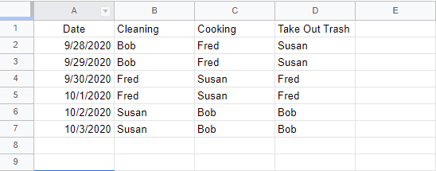
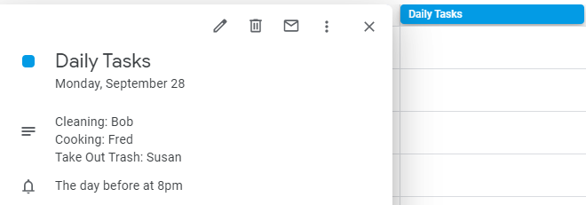

# Scheduler
Creates an all day google calendar event based on entries in a google sheet

## Usage
This is designed to pull data from a spreadsheet and create an all day event with the data put into the spreadsheet.
It turns this:

to something like:

Then it deletes all those events that have already happened on the spreadsheet (not on calendar)!

## How to use!
It takes a little setup but you can do it!

You will need:
Spreadsheet ID of the spreadsheet with scheduling information (it is the long string in the url)
Calendar ID of the calendar that will be added to (it is in the settings)
Name of the first sheet.

You need a spreadsheet with two sheets on it.

img src="images/exampleSpreadsheet.png" alt="sampleSpreadsheet" width="200"/>

The title of the first sheet can be whatever you want as long as it matches the script (we will get to that in a moment!)
The title of the second sheet, Calendar_IDs, can also be changed as long as it matches the script but Calendar_IDs is recommended.
The first column should contain dates starting in the second row with the word "Date" in the first row
The next column titles can be whatever you need.
Fill in the assigned roles.
Here is an example:

Open up the script in Google's script editor.
Check the update lines at the top of the script lines: 12,14,28,30,50,77,97,99 will need to be changed.
Fill them with the appropriate information.

Run the script and see the calendar events!

It is recommended to attach the functions to triggers to automate the process. See Google's docs for more information!

## Feel free to use or edit the script, however, you wish!
